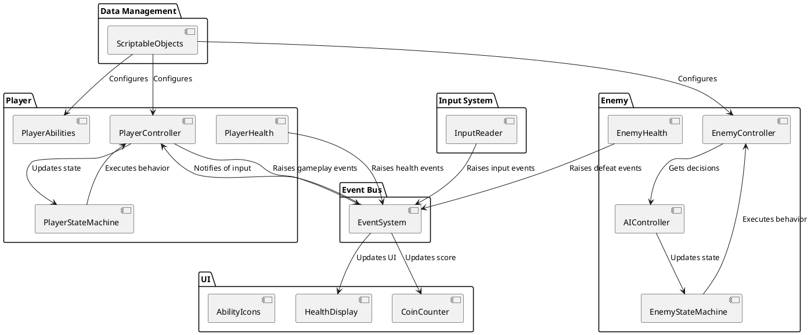
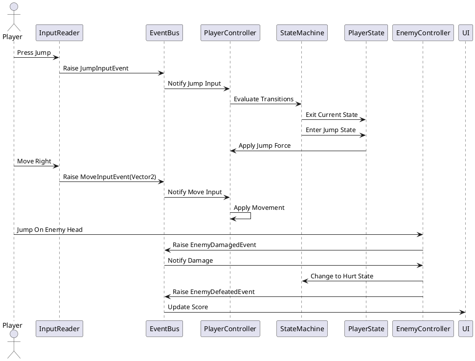
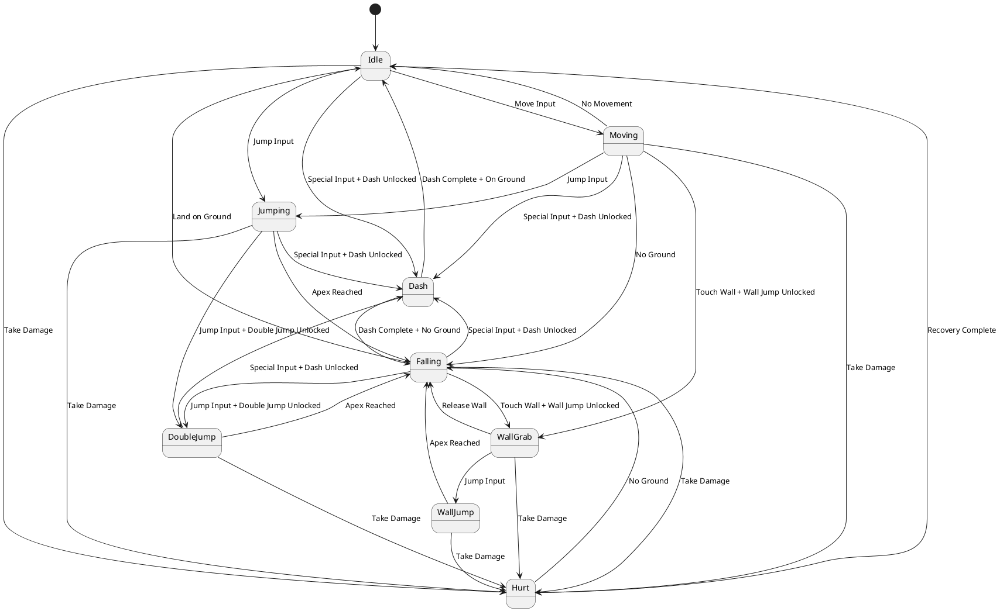
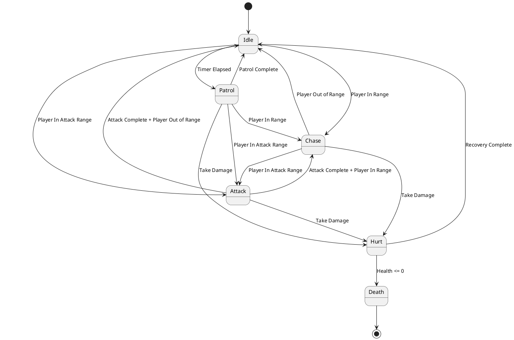
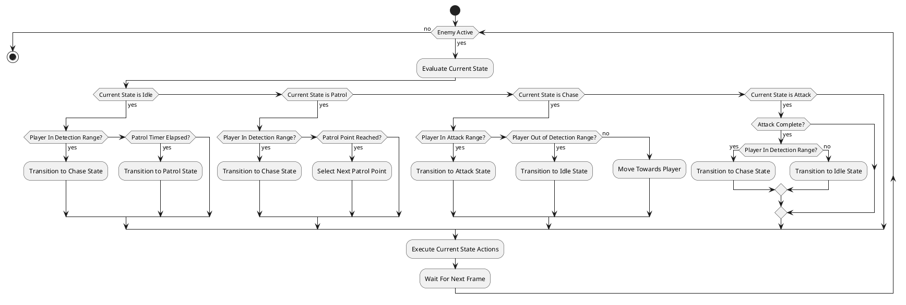

# Petals of Hope - System Architecture Diagrams

## Core Architecture Class Diagram

```plantuml
@startuml "Petals of Hope - Core Architecture"

' Style settings
skinparam classAttributeIconSize 0
skinparam classFontStyle bold
skinparam packageStyle rectangle
skinparam linetype ortho

' Main packages
package "Event Bus System" {
  abstract class BaseEventSO {
    -listeners: List<EventListener>
    +RegisterListener(listener: EventListener)
    +UnregisterListener(listener: EventListener)
    +RaiseEvent()
  }
  
  class GameEventSO {
    +RaiseEvent()
  }
  
  class TypedEventSO<T> {
    +RaiseEvent(value: T)
  }
  
  class EventListener {
    -eventSO: BaseEventSO
    -response: UnityEvent
    +OnEventRaised()
  }
  
  BaseEventSO <|-- GameEventSO
  BaseEventSO <|-- TypedEventSO
  BaseEventSO "1" -- "*" EventListener : registers >
}

package "Data Management" {
  abstract class EntityStatsSO {
    +health: int
    +damage: int
  }
  
  class PlayerStatsSO {
    +movementSpeed: float
    +jumpHeight: float
  }
  
  class EnemyStatsSO {
    +detectionRange: float
    +attackRate: float
  }
  
  class BossStatsSO {
    +attackPatterns: List<AttackPattern>
    +phases: int
  }
  
  abstract class AbilitySO {
    +isUnlocked: bool
    +cooldown: float
  }
  
  class DoubleJumpSO {
    +jumpForce: float
  }
  
  class WallJumpSO {
    +jumpForce: float
    +pushForce: float
  }
  
  class DashSO {
    +dashForce: float
    +dashDuration: float
  }
  
  class LevelSettingsSO {
    +environmentType: EnvironmentType
    +hazards: List<HazardConfig>
  }
  
  EntityStatsSO <|-- PlayerStatsSO
  EntityStatsSO <|-- EnemyStatsSO
  EntityStatsSO <|-- BossStatsSO
  AbilitySO <|-- DoubleJumpSO
  AbilitySO <|-- WallJumpSO
  AbilitySO <|-- DashSO
}

package "Input System" {
  class InputReader {
    -inputActions: InputActionAsset
    +OnMoveEvent: event<Vector2>
    +OnJumpEvent: event
    +OnSpecialEvent: event
    +OnMenuEvent: event
    +Initialize()
    +EnableGameplayInput()
    +EnableMenuInput()
    +DisableAllInput()
  }
}

package "State Machine" {
  abstract class BaseState {
    #stateMachine: StateMachine
    +Enter()
    +Exit()
    +Update()
    +FixedUpdate()
  }
  
  class StateMachine {
    -currentState: BaseState
    -states: Dictionary<string, BaseState>
    -transitions: Dictionary<string, List<Transition>>
    +ChangeState(stateName: string)
    +RegisterState(stateName: string, state: BaseState)
    +RegisterTransition(fromState: string, toState: string, transition: Transition)
    +Update()
    +FixedUpdate()
  }
  
  abstract class Transition {
    #toState: string
    +ShouldTransition(): bool
  }
  
  class InputTransition {
    -inputEvent: BaseEventSO
    +ShouldTransition(): bool
  }
  
  class DecisionTransition {
    -decision: BaseDecision
    +ShouldTransition(): bool
  }
  
  ' Player States
  abstract class PlayerState {
    #playerController: PlayerController
  }
  
  class IdleState {
  }
  
  class MovingState {
    -moveSpeed: float
  }
  
  class JumpingState {
    -jumpForce: float
  }
  
  class FallingState {
  }
  
  class DoubleJumpState {
    -doubleJumpForce: float
  }
  
  class WallGrabState {
  }
  
  class WallJumpState {
    -wallJumpForce: Vector2
  }
  
  class DashState {
    -dashForce: float
    -dashDuration: float
  }
  
  class HurtState {
    -invincibilityDuration: float
  }
  
  ' Enemy States
  abstract class EnemyState {
    #enemyController: EnemyController
  }
  
  class EnemyIdleState {
  }
  
  class PatrolState {
    -patrolSpeed: float
  }
  
  class ChaseState {
    -chaseSpeed: float
  }
  
  class AttackState {
    -attackDuration: float
  }
  
  class EnemyHurtState {
  }
  
  class DeathState {
  }
  
  BaseState <|-- PlayerState
  BaseState <|-- EnemyState
  
  PlayerState <|-- IdleState
  PlayerState <|-- MovingState
  PlayerState <|-- JumpingState
  PlayerState <|-- FallingState
  PlayerState <|-- DoubleJumpState
  PlayerState <|-- WallGrabState
  PlayerState <|-- WallJumpState
  PlayerState <|-- DashState
  PlayerState <|-- HurtState
  
  EnemyState <|-- EnemyIdleState
  EnemyState <|-- PatrolState
  EnemyState <|-- ChaseState
  EnemyState <|-- AttackState
  EnemyState <|-- EnemyHurtState
  EnemyState <|-- DeathState
  
  Transition <|-- InputTransition
  Transition <|-- DecisionTransition
  
  StateMachine "1" -- "*" BaseState : contains >
  StateMachine "1" -- "*" Transition : manages >
}

package "AI System" {
  abstract class BaseDecision {
    +Decide(): bool
  }
  
  abstract class BaseAction {
    +Execute()
  }
  
  class AIController {
    -decisions: Dictionary<string, BaseDecision>
    -actions: Dictionary<string, BaseAction>
    -stateMachine: StateMachine
    +Initialize(stateMachine: StateMachine)
    +RegisterDecision(decisionName: string, decision: BaseDecision)
    +RegisterAction(actionName: string, action: BaseAction)
    +EvaluateDecisions()
    +ExecuteAction(actionName: string)
  }
  
  ' Specific Decisions
  class PlayerInRangeDecision {
    -detectionRange: float
  }
  
  class HealthBelowThresholdDecision {
    -threshold: float
  }
  
  class TimerElapsedDecision {
    -duration: float
  }
  
  ' Specific Actions
  class MoveToTargetAction {
    -moveSpeed: float
  }
  
  class AttackAction {
  }
  
  class PatrolAction {
    -patrolPoints: List<Vector2>
  }
  
  BaseDecision <|-- PlayerInRangeDecision
  BaseDecision <|-- HealthBelowThresholdDecision
  BaseDecision <|-- TimerElapsedDecision
  
  BaseAction <|-- MoveToTargetAction
  BaseAction <|-- AttackAction
  BaseAction <|-- PatrolAction
  
  AIController "1" -- "*" BaseDecision : evaluates >
  AIController "1" -- "*" BaseAction : executes >
}

package "Core Game Components" {
  class PlayerController {
    -stateMachine: StateMachine
    -playerStats: PlayerStatsSO
    -inputReader: InputReader
    +Initialize()
    +Move(direction: Vector2)
    +Jump()
    +PerformSpecialAbility()
  }
  
  class PlayerHealth {
    -currentHealth: int
    -maxHealth: int
    -healthChangedEvent: TypedEventSO<int>
    -playerDiedEvent: GameEventSO
    +TakeDamage(amount: int)
    +Heal(amount: int)
  }
  
  class PlayerAbilities {
    -doubleJumpAbility: DoubleJumpSO
    -wallJumpAbility: WallJumpSO
    -dashAbility: DashSO
    -abilityUnlockedEvent: TypedEventSO<AbilitySO>
    +UnlockAbility(ability: AbilitySO)
    +IsAbilityUnlocked(abilityType: AbilityType): bool
  }
  
  class EnemyController {
    -stateMachine: StateMachine
    -aiController: AIController
    -enemyStats: EnemyStatsSO
    +Initialize()
    +Patrol()
    +Chase(target: Transform)
    +Attack()
  }
  
  class EnemyHealth {
    -currentHealth: int
    -maxHealth: int
    -healthChangedEvent: TypedEventSO<int>
    -enemyDefeatedEvent: GameEventSO
    +TakeDamage(amount: int)
  }
  
  class EnemyAttack {
    -damage: int
    -attackRange: float
    +CanAttack(target: Transform): bool
    +PerformAttack()
  }
  
  PlayerController "1" -- "1" PlayerHealth : has >
  PlayerController "1" -- "1" PlayerAbilities : has >
  PlayerController "1" -- "1" StateMachine : uses >
  PlayerController "1" -- "1" InputReader : listens to >
  PlayerController "1" -- "1" PlayerStatsSO : configured by >
  
  EnemyController "1" -- "1" EnemyHealth : has >
  EnemyController "1" -- "1" EnemyAttack : has >
  EnemyController "1" -- "1" StateMachine : uses >
  EnemyController "1" -- "1" AIController : uses >
  EnemyController "1" -- "1" EnemyStatsSO : configured by >
}

' Cross-package relationships
InputReader ..> BaseEventSO : raises events >
DecisionTransition ..> BaseDecision : evaluates >
InputTransition ..> BaseEventSO : listens to >
AIController ..> StateMachine : triggers transitions >
PlayerHealth ..> TypedEventSO : raises events >
EnemyHealth ..> TypedEventSO : raises events >
PlayerAbilities ..> AbilitySO : uses >

@enduml
```

## System Interaction Diagram

## Event Flow Diagram

## State Machine Diagram

## AI Decision Making Diagram

